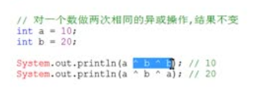

## 位运算


##### 异或

- 对一个数进行两次完全相同的异或运算后会得到原来的数



- 任何数和0异或，都得它本身
- 任何数和`全1`异或，都得取反
- 任何数与`全1`&，都得本身

#### 移位运算

```cpp
1<<n = 2^n; 
n>>1 近似等于 n/2;当n为正相等，n为负不等;前者向下取整，后者向0取整
```

#### 二进制状态压缩

> 指将一个长度为`m`的`bool`数组用一个`m`位的二进制整数表示存储

`0~k-1`

| 操作         | 运算           |
| ------------ | -------------- |
| 取最后一位   | `n&1`          |
| 取第k位      | `(n>>k)&1`     |
| 取0~k-1位    | `n&((1<<k)-1)` |
| 将第k位取反  | `n xor (1<<k)` |
| 将第k位赋值1 | `n|(1<<k)`     |
| 将第k位赋值0 | `n&(~(1<<k))`  |

#### 成对变换

n为偶数时 `n xor 1=n+1`

n为奇数时 `n xor 1=n-1`


#### `lowbit`运算

取从低位到高位第一个1以及后面的0组成的数字

`lowbit(n)=n&(~n+1)=n&(-n)`

#### 快速幂:star:

##### 解决问题

> a^b mod p

##### 模板

```cpp
int power(int a,int b,int p){
    int ans=1%p;
    for(;b;b>>=1){
        if(b&1) ans=(long long )ans*a %p;
        a=(long long)a*a%p;
    }
    return ans;
}
```

##### 推导

进阶指南`P4`

> `if(b&1)`是判断当前这位要不要加到答案里面去
>
> `a=a*a%p`就是让a变到当前处理的位置

#### 64位整数乘法

求`a*b mod p`

与快速幂同理

```cpp
ll mul(ll a,ll b,ll p){
    ll ans=0;
    for(;b;b>>=1){
        if(b&1) ans=(ll)(ans+a)%p;
        a=(ll)a*2%p;
    }
    return ans;
}
```


