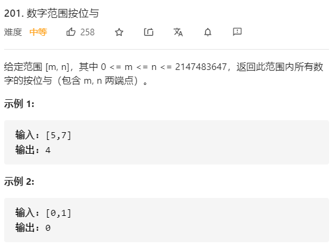
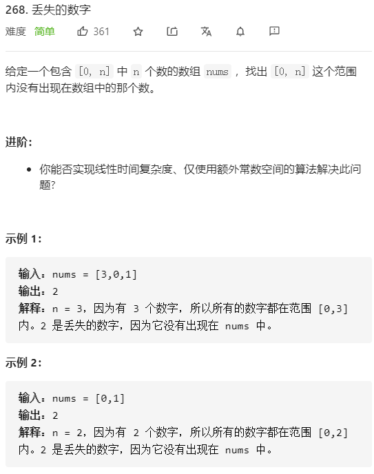
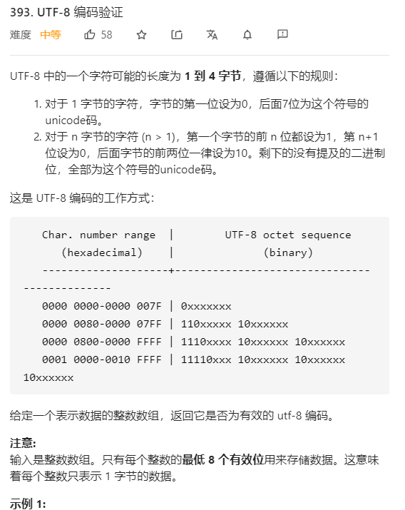

### 1.数字范围按位与



```cpp
class Solution {
public:
    int rangeBitwiseAnd(int m, int n) {
            
            int cnt=0;
            while(m<n){
                m>>=1;
                n>>=1;
                cnt++;
            }
            return m<<cnt;
    }
};
```

#### 公共前缀:

>[m,n]中所有数的二进制字符串的公共前缀 等于 m和n两个数的公共前缀

> [m,n]中所有数的按位与的结果恰巧就等于他们的二进制字符串的公共前缀

#### 求公共前缀

使用位移的方法，当两个数的值不相等的时候，一直右移，直到两个数相等。再将其中任意一个数左移右移那么多位即可。


### [2.丢失的数字](https://leetcode-cn.com/problems/missing-number/)




#### 使用哈希表

```cpp
class Solution {
public:
    int missingNumber(vector<int>& nums) {
            int len=nums.size();
            // [0,len]之间的数字少了一个
            unordered_map<int,int> map;
            for(int i=0;i<len;i++){
                map[nums[i]]=1;
            }
            for(int i=0;i<=len;i++){
                if(map[i]!=1) return i; 
            }
            return 0;
    }
};
```


#### 使用位运算

```cpp
class Solution {
public:
    int missingNumber(vector<int>& nums) {
        int len=nums.size();
        int ans=0;
        for(int i=0;i<=len;i++){
            ans^=i;
        }
        for(int i=0;i<len;i++){
            ans^=nums[i];
        }
        return ans;
    }
};
```

因为一个数与同一个数进行两次异或运算仍得原数

而且任何一个数和0进行异或运算仍得原数

所以

先将0...n进行异或，再将得到的结果与数组中的所有数字进行异或，这样，最后得到的数字即为缺失的数，因为只有它没有被接走:happy:


### 3. [UTF编码验证](https://leetcode-cn.com/problems/utf-8-validation/)




> 其实这道题按我的方法的话用到的位运算的地方主要就是二进制状态压缩中的那几个操作。
>
> 别的就是一些细节和基本的循环了
>
> 细节的话，注意那些题目中列出的条件，以后在做题的时候首先应该把条件列出来，不然很容易因为忽略条件导致case不过
>
> 基本的循环的话就是这个for中套for的二重循环了..

```cpp
class Solution {
public:
    bool validUtf8(vector<int>& data) {
        int len=data.size();

        if(len==1&&isOne(data[0],7)) return false;
        //取低八位
        for(int i=0;i<len;i++){
            data[i]=data[i]&((1<<8)-1);
        }
	    
        //遍历整个数组，但是并不指定i的变化，由里面来更新！
        for(int i=0;i<len;){
            //判断1个字节的情况
            if(!isOne(data[i],7)) {
                i++;
                continue;
            }
            else {
                
                //计算出1的数量
                int count=oneCount(data[i]);
                
                //根据题目的条件来剪枝
                if(count>4 || count==1) return false;
                //使用for循环再判断是否有那么多个
                for(int j=i+1;j<i+count;j++){
                    if(j>=len) return false; //注意这个，因为是从i+1开始...
                    if(check(data[j])) continue;
                    else return false;
                }
                i+=count;//在这个地方更新i
            }
        }
        return true;

    }

    //判断某一位是否为1
    bool isOne(int n,int k){
        if(((n>>k)&1)==1) return true;
        else return false;
    }

    int oneCount(int n){
        int count=0;
        int idx=7;
        while(idx>=0 &&isOne(n,idx)){
            count++;
            idx--;
        }
        return count;
    }

    bool check(int n){
        if(((n>>7)&1)==1  &&  ((n>>6)&1)==0) return true;
        else return false;
    }
};
```

