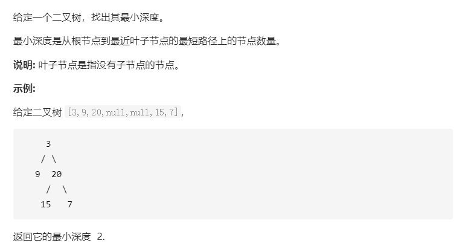
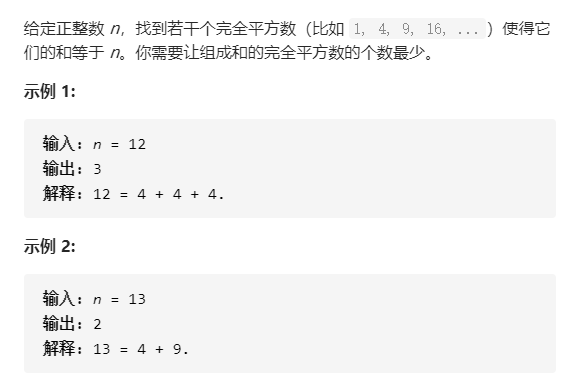
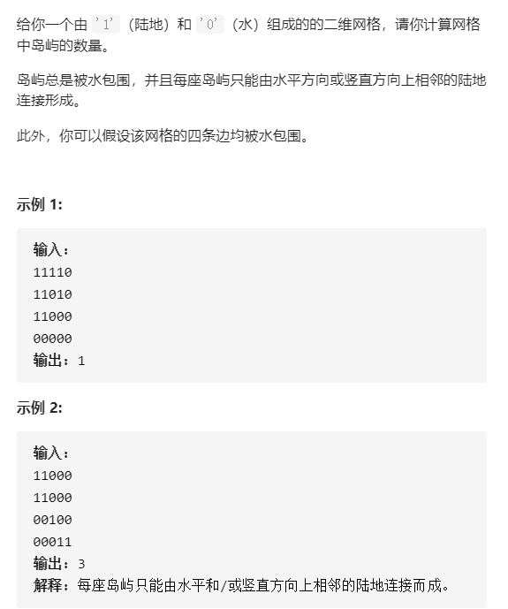

# BFS

### 思想方法

1. BFS基本模板
	a. 和DFS大同小异，只是扩展的时候，一个是dfs()，一个是入队，别的没啥大差别
	b. BFS不用回溯，因为BFS是层状搜索，不用往回搜。


2. BFS常用套路

	a. 用结构体或者一个pair来代表一个状态，状态的设计很关键，见推箱子的`d[x][y][lie]`，将变化的部分提取为状态，后面就是状态的转移。
	b. 结果集:通常创建一个d数组用于保存从起点到该状态的最小步数
	c. bfs不用回溯,而且每个节点最多访问一次?=>毕竟是层状遍历，不可能访问第二遍
	d. 预先保存状态转移时状态各个量变化的常数数组

`ps.`一般竖向是`x`,横向是`y`;


算法的实现部分其实并不是很多，重要的是状态的选择和模型的建立  模块化分析

我的问题:
	一个算法可以解决什么样的问题?
	eg. BFS => 从(x,y,lie1)到(m,n,lie2),且已知每个状态的选择转移方式,求最短或者最少的次数。


思路 -> 实现


[***BFS模板,核心题***](https://www.acwing.com/problem/content/174/)

---

模板

```cpp
int bfs(){
    memset(d,-1,sizeof d);//作为结果集，同样用来判断当前的点有没有被访问过
    queue<state> q;
    
    //处理起点
    state begin;
    d[begin.x][begin.y]=0; //1. 初始化结果集
    q.push(begin); //2. 入队
    
    //循环
    while(q.size()){
        state now=q.front();
        q.pop();
        
        //开始转移
        for(int i=0;i<4;i++){
            state next;
            next.x=now.x+dx[i],next.y=now.y+dy[i];
            
            //判断，转移，入队，(判终)
            if(invalid(next)) continue;
            if(d[next.x][next.y]==-1){ //代表初次访问
                d[next.x][next.y]=d[now.x][now.y]+1;
                
                q.push(next);
                
                /*可能会有判终
                if(next.x==xxx&&next.y==yyy){
                    return d[next.x][next.y];
                }*/
            }
        }
    }
}
```


### 经典题

##### [推箱子(答案有点问题但是整体思想没错)](https://www.acwing.com/problem/content/174/)

```cpp
#include<iostream>
#include<algorithm>
#include<queue>
#include<cstring>
using namespace std;

int n,m;//n行m列 n->x ,m->y
const int N = 502;
char s[N][N];//地图
int d[N][N][4]; // 结果集 d[x][y][lie]

struct rec
{
    int x,y,lie; //x,y是坐标,y是石块的立或者躺的状态
    /*
        lie = 0 => 立着
        lie = 1 => 左右平放,x,y代表着左边的坐标
        lie = 2 => 上下平放,x,y代表着上面的坐标
     */
};


//const int dx[4]={0,0,-1,1},dy[4]={-1,1,0,0};//左右上下
const int next_x[3][4]={{0,0,-2,1},{0,0,-1,1},{0,0,-1,2}};//代表着3个状态下,往左右上下四个方向移动的时候的坐标变化
const int next_y[3][4]={{-2,1,0,0},{-1,2,0,0},{-1,1,0,0}};
const int next_lie[3][4]={{1,1,2,2},{0,0,1,1},{2,2,0,0}};

rec bg,begin1,begin2,ed;//begin,end;


//判断是否越了地图的界
bool valid(int x,int y){
    if(x<0||x>=n||y<0||y>=m) return false;
    return true;
}

//判断是否满足立着是否是. ,滚动是否到 #
bool valid(rec next){
    if(!valid(next.x,next.y)) return false;
    if(s[next.x][next.y]=='#') return false;
    
    
    //立着的情况
    if(next.lie==0&&s[next.x][next.y]!='.') return false;
    
    //滚到 # 的情况
    if(next.lie=1&&s[next.x][next.y+1]=='#') return false;
    if(next.lie=2&&s[next.x+1][next.y]=='#') return false;
    
    //其余情况都合法
    return true;
}

void input_and_init(){

        bool more=false;
        char tmp;
        for(int i=0;i<n;i++){
            for(int j=0;j<m;j++){
               cin>> tmp;
               if(tmp=='X'){
                   if(!more){
                       begin1.x=i,begin1.y=j;
                       more=true;
                   }else{
                       begin2.x=i,begin2.y=j;
                   }
               }else if(tmp=='O'){
                   s[i][j]='.';
                   ed.x=i,ed.y=j,ed.lie=0;
               }
            }
        }
        if(!more){
            bg.x=begin1.x,bg.y=begin1.y,bg.lie=0;
        }else{
            s[begin1.x][begin1.y]='.';
            s[begin2.x][begin2.y]='.';
            bg.x=min(begin1.x,begin2.x);
            bg.y=min(begin1.y,begin2.y);
            if(begin1.x==begin2.x) bg.lie=1;
            else bg.lie=2;
        }
}

//给出最短的步数，如果没有输出-1
int bfs(){
    // memset(d,-1,sizeof d);
    for(int i=0;i<n;i++){
        for(int j=0;j<m;j++){
            for(int k=0;k<3;k++){
                d[i][j][k]=-1;
            }
        }
    }
    queue<rec> q;
    
    
    d[bg.x][bg.y][bg.lie]=0;
    q.push(bg);
    
    while(q.size()){
        rec now=q.front();
        q.pop();
        
        
        //bfs一般是在扩展的时候进行判断而不是在当前进行判断
        for(int i=0;i<4;i++){
            rec next;
            next.x=now.x+next_x[now.lie][i],next.y=now.y+next_y[now.lie][i];
            next.lie=next_lie[now.lie][i];
            if(!valid(next)) continue;
            if(d[next.x][next.y][next.lie]==-1){
                //判断，转移，入队，判终
                d[next.x][next.y][next.lie]=d[now.x][now.y][now.lie]+1;
                
                q.push(next);
                
                if(next.x==ed.x&&next.y==ed.y&&next.lie==ed.lie){
                    return d[next.x][next.y][next.lie];
                }
            }
            
        }
    }
    return -1;
    
}

int main(){
    
    while(true){
        cin>>n>>m;
        if(n==0&&m==0) break;
        input_and_init();
        int ans=bfs();
        if(ans==-1){
            cout<<"Impossible"<<endl;
        }else{
            cout<<ans<<endl;
        }
    }
    
    return 0;
}
```


##### [矩阵距离](https://www.acwing.com/problem/content/175/)

```cpp
#include<iostream>
#include<algorithm>
#include<cstring>
#include<queue>

using namespace std;

int n,m;
const int N = 1010;

int s[N][N];
int d[N][N]; //d[i][j]代表B[i][j],也即某个1到此点的最小值
int dx[4]={0,0,-1,1},dy[4]={-1,1,0,0};


void bfs(){
    queue<pair<int,int>> q;
    memset(d,-1,sizeof d);
    
    for(int i=0;i<n;i++){
        for(int j=0;j<m;j++){
            if(s[i][j]=='1'){
                q.push(make_pair(i,j));
                d[i][j]=0;
            }
        }
    }
    
    while(q.size()){
        pair<int,int> now=q.front();
        q.pop();
        
        for(int i=0;i<4;i++){
            pair<int,int> next;
            next.first=now.first+dx[i];
            next.second=now.second+dy[i];
            
            if(next.first<0||next.first>=n||next.second<0||next.second>=m) continue;
            if(d[next.first][next.second]==-1){
                d[next.first][next.second]=d[now.first][now.second]+1;
                q.push(next);
            }
           
        }
        
    }
}

int main(){
    
    //输入
    cin>>n>>m;
    char tmp;
    for(int i=0;i<n;i++){
        for(int j=0;j<m;j++){
            cin>>tmp;
            s[i][j]=tmp;
        }
    }
    
    bfs();
    
    for(int i=0;i<n;i++){
        for(int j=0;j<m;j++){
            cout<<d[i][j]<<" ";
        }
        cout<<endl;
    }
    return 0;
}
```


#### ---


```
1. 用于那些比如最短距离之类的最短的这种问题，这是BFS的优势
2. BFS是一层一层搜
3. BFS空间复杂度较高，DFS的空间复杂度低
4. BFS不会爆栈,DFS可能会爆栈
5. 一般DFS比BFS常用一些
```


#### [111. 二叉树的最小深度(递归深搜)](https://leetcode-cn.com/problems/minimum-depth-of-binary-tree/)



```cpp
/*
1. 到最近的叶子结点，注意是叶子结点，中间的结点不算
2. 遇到与树有关的问题，先考虑递归方向，考虑当前这层和下层之间有哪些情况，什么时候返回
3. 做算法题，首先要考虑特殊情况的处理
4. 不算特殊的null情况，一共有三种情况，第一种是都不为空，那么取min再加上1；第二种是有一边为空，那么取不空的那一边再加1。第三种是两边都为空，那么就可以直接返回1，但包含在第二种情况里了；因为是树嘛！所以每一层管好自己就好
你怎么知道是BFS?我怎么感觉像是DFS？？
*/
/**
 * Definition for a binary tree node.
 * struct TreeNode {
 *     int val;
 *     TreeNode *left;
 *     TreeNode *right;
 *     TreeNode(int x) : val(x), left(NULL), right(NULL) {}
 * };
 */
class Solution {
public:
    int minDepth(TreeNode* root) {
        if(root==NULL) return 0;
        int left=minDepth(root->left);
        int right=minDepth(root->right);
        if(!left||!right){
            return 1+right+left;
        }
        return min(left,right)+1;
    }
};
```


#### [279. 完全平方数(BFS)](https://leetcode-cn.com/problems/perfect-squares/)




```cpp
class Solution {
public:
/*
1.  最小，立即推贪心，BFS或者DP，
    但是贪心好像不太行
2.  队列中放的是当前的数字，我们只需要判断然后更新距离

dis[x] --> 到x值所需要用到的最小个数
初始的话肯定要最大值嘛
*/
    int numSquares(int n) {
        queue<int> q;
        vector<int> dis(n+1,INT_MAX);//dis[x] --> 到x值所需要用到的最小个数,初始的话肯定要最大值嘛
        q.push(0);
        dis[0]=0; //进行一些初始化
        while(q.size()){
            int top=q.front();
            q.pop();  //bfs模板
            if(top==n) return dis[top]; //取出队头的数字，判断是否到终点
            for(int i=1;i*i+top<=n;i++){//不满足的话，也要寄希望于部下，枚举就完事了，这里i*i+top<=n,避免了很多别的没必要的情况
                int now=i*i+top; //对当前的这个部下进行一些判断，和更新结果操作
                if(dis[now]>dis[top]+1){
                    dis[now]=dis[top]+1;
                    q.push(now);  //在满足一定情况下放入队列
                }
                //这里只枚举dis[now]>dis[top]+1的情况，是因为如果小于的话肯定无需修改啊...
            }
        }
        return 0;
    }
};
```

#### [733. 图像渲染(Floodfill)](https://leetcode-cn.com/problems/flood-fill/)

```cpp
class Solution {
public:
    vector<vector<int>> floodFill(vector<vector<int>>& image, int sr, int sc, int newColor) {
        //先特判，LeetCode特色
        if(image.empty()||image[0].empty()) return image;

        //下面跟dfs超像，感觉搜索都是这个样子
        int oldColor=image[sr][sc]; 
        if(oldColor==newColor) return image; //这个可以算是当前是否达到终点
        int dx[4]={-1,0,1,0},dy[4]={0,1,0,-1};
        image[sr][sc]=newColor; //插旗
        for(int i=0;i<4;i++){
            int x=sr+dx[i],y=sc+dy[i];
            if(x>=0&&x<image.size()&&y>=0&y<image[0].size()&&image[x][y]==oldColor){//如果不越界且符合条件，就继续搜
                floodFill(image,x,y,newColor);
            }
        }
        return image;
    }
};
```

#### [200. 岛屿数量(Floodfill)](https://leetcode-cn.com/problems/number-of-islands/)



```cpp
class Solution {
public:
    int n,m;

    /*
        
        扫盲点：
        这道题怎么想的？
            每次遇到一个1，就把它所在的连通块都置为0，这样最终结果就等于1的个数
        我怎么想的？ ...
        为什么这么想？ 
            一般这种，类似于染色问题的东西都可以用floodfill算法来解决，稍微思考一下即可
            这题，floodfill是找一整块，咱们就把这一整块化作一个，都染成0，就很妙
        总结
        讲一手
    */

    int numIslands(vector<vector<char>>& grid) {
        if(grid.empty()||grid[0].empty()) return 0;
        int ans=0;
        
        n=grid.size(),m=grid[0].size();
        for(int i=0;i<n;i++){
            for(int j=0;j<m;j++){
                if(grid[i][j]=='1') {
                    ans++;
                    floodfill(grid,i,j);
                }
            }
        }
        return ans;
    }
    void floodfill(vector<vector<char>> & grid,int x,int y){
        int dx[4]={-1,0,1,0},dy[4]={0,1,0,-1};
        grid[x][y]='0';
        for(int i=0;i<4;i++){
            int a=x+dx[i],b=y+dy[i];
            if(a>=0&&a<n&&b>=0&b<m&&grid[a][b]=='1'){
                floodfill(grid,a,b);
            }
        }
    }
};
```

#### [130. 被围绕的区域(Floodfill)](https://leetcode-cn.com/problems/surrounded-regions/)


```cpp
class Solution {
public:

    /*
        补集思想，正难则反，直接求不容易，所以我们先把边上的求出，再反推出要求的结果
        思路：先遍历边，把边上的O的连通块都标记为‘&’，然后再遍历整个数组，把&变为O，把O变为X

        出现了一个低级错误 赋值写成==了....以后别错了
        还有一个低级错误就是哎呀好难过board[a][b]写成board[x][y]了
    */
    int n,m;
    void solve(vector<vector<char>>& board) {
        if(board.empty()||board[0].empty()) return;
        n=board.size(),m=board[0].size();
        //cout<<n<<" "<<m<<endl;
        //两条竖边
        for(int i=0;i<n;i++){
            if(board[i][0]=='O') dfs(board,i,0);
            if(board[i][m-1]=='O') dfs(board,i,m-1);
        }
        //两条横边
        for(int i=0;i<m;i++){
            if(board[0][i]=='O') dfs(board,0,i);
            if(board[n-1][i]=='O') dfs(board,n-1,i);
        }
    
        for(int i=0;i<n;i++){
            for(int j=0;j<m;j++){
                if(board[i][j]=='O') board[i][j]='X';
                if(board[i][j]=='&') board[i][j]='O';
            }
        }
        
        return ;
    }

    void dfs(vector<vector<char>>& board,int x,int y){
        int dx[4]={-1,0,1,0},dy[4]={0,1,0,-1};
        board[x][y]='&';
        for(int i=0;i<4;i++){
            int a=x+dx[i],b=y+dy[i];
            if(a>=0&&a<n&&b>=0&&b<m&&board[a][b]=='O') dfs(board,a,b);
        }
        return ;
    }
};
```

