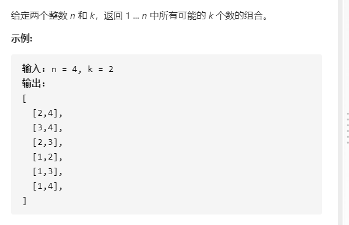

### DFS刷题

#### [组合](https://leetcode-cn.com/problems/combinations/)



```cpp
class Solution {
public:
/*
1. 解的形式
2. 枚举谁
3. 枚举对象的选择
*/
    vector<vector<int>> res;
    void dfs(int u,vector<int> path,int n,int k){

        //problem1. 剪枝
        if(path.size()+n-u+1<k) return ;

        //problem2. 终点判断的顺序 
        if(path.size()==k){
            res.push_back(path);
            return ;
        }
        // 将枚举出来的结果加入到res中
        if(u==n+1){
            return ;
        }
        //枚举对象为当前的数u,有选和不选两个选择
   
        //problem3 遍历的过程

        //不选
        dfs(u+1,path,n,k);

        //选
        path.push_back(u);
        dfs(u+1,path,n,k);
        path.pop_back();

        
    }

    vector<vector<int>> combine(int n, int k) {
        vector<int> vec;
        dfs(1,vec,n,k);
        return res;
    }
};
```

***扫盲点***

`dfs`的遍历过程

> 一般都是回溯的。就是不撞南墙不回头嘛！先找到一个解，然后回溯。

判断的顺序

> 一般都是先**将解加到集合里**，再剪枝，再判断是否到达终点？

***扫思路***

想法还是按照`dfs`的通用想法来考虑

1. 首先确定解的形式

```
[2,4]
```

2. 确定枚举对象

```
给定两个整数 n 和 k，返回 1 ... n 中所有可能的 k 个数的组合。
```

​	根据原来的做题经验，这个枚举对象一般是固定的，这里是n个数

3. 每个枚举对象的选择

   这里每个数有两种选择，一种是选，一种是不选

   选的话就要恢复现场，因为把这个东西加入path了，等会回溯回来还是要用这个

           //选
           path.push_back(u);
           dfs(u+1,path,n,k);
           path.pop_back();

   不选的话就直接递归下一层就好了

           //不选
           dfs(u+1,path,n,k);

#### [二叉树的所有路径](https://leetcode-cn.com/problems/binary-tree-paths/)


```cpp
/**
 * Definition for a binary tree node.
 * struct TreeNode {
 *     int val;
 *     TreeNode *left;
 *     TreeNode *right;
 *     TreeNode() : val(0), left(nullptr), right(nullptr) {}
 *     TreeNode(int x) : val(x), left(nullptr), right(nullptr) {}
 *     TreeNode(int x, TreeNode *left, TreeNode *right) : val(x), left(left), right(right) {}
 * };
 */
class Solution {
public:
    vector<string> ans;
    vector<vector<int>> res;
    vector<int> path;
    vector<string> transform(){
        vector<string> vs;
        for(auto vec:res){
            string tmp;
            for(int i=0;i<vec.size();i++){
                i==0?tmp+=to_string(vec[i]):tmp=tmp+"->"+to_string(vec[i]);
            }
            vs.push_back(tmp);
        }
        return vs;
    }

    void dfs(TreeNode* root){
        // 找出以root为根的二叉树的所有从根到叶子节点的路径
        //保证root不为空，且当前节点已经处理
        if(root->left==NULL && root->right==NULL){
            res.push_back(path);
            return ;
        }
        if(root->left!=NULL){
            path.push_back(root->left->val);
            dfs(root->left);    
            path.pop_back();
        }
        if(root->right!=NULL){ 
            path.push_back(root->right->val);
            dfs(root->right);   
            path.pop_back(); 
        }

    }

    vector<string> binaryTreePaths(TreeNode* root) {
        if(root==NULL) return ans;
        path.push_back(root->val);
        dfs(root);
        ans=transform();
        return ans;
    }
};
```

***扫盲点***

`数字1转为字母1`

> ```cpp
> char c = to_string(1)
> ```

`dfs中的状态`

> 在写dfs函数之前，必须明确dfs函数处理的当前对象处于什么状态
>
> 是已经处理完了，还是没有处理，据此进行代码的编写
>
> 就比如这道题！

***扫思路***

`transfrom函数的编写的思想`

> 以后再遇到这种类似的问题的时候，就按照最舒服的方式处理，接收最舒服的数据类型，最后再用一个函数来处理格式！要将心思放在核心问题上面！

`dfs函数的编写`

> 明确dfs函数处理的对象当前处于什么状态！
>
> 我是考虑先在main函数处理这个对象，在dfs函数中对"小兵"进行处理即可

