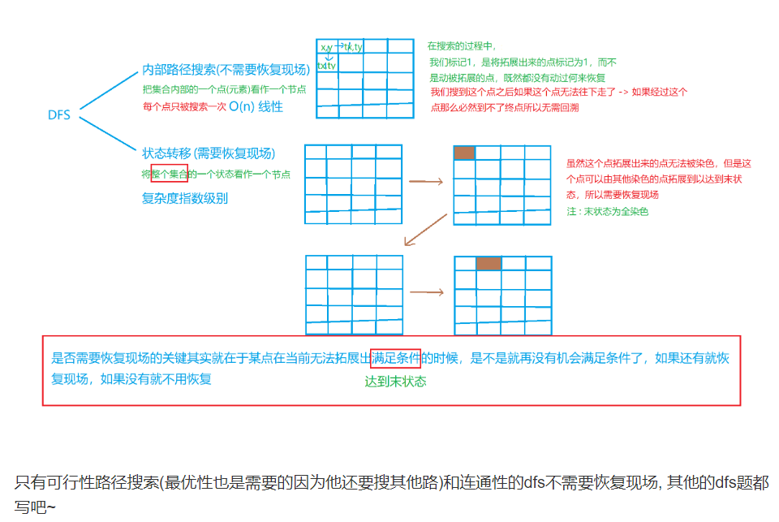

# 深搜

## DFS理论方法

***一定要厘清各个变量的含义，否则写代码的时候会出现很多细节问题!!!***

***在写dfs函数的时候，最好找某个状态为例子进行写，这样思路清晰一些***


#### 1.when用

> https://www.cnblogs.com/DWVictor/p/10048554.html
>
> 只要能枚举出来的，都能用搜索算法。

#### 2.模板  &&  思路

***一般思路***

> 1. 确定解的形式
> 2. 枚举谁?
> 3. 每个枚举对象的选择?

***选和不选的思路***


```java
/**
 * DFS核心伪代码
 * 前置条件是visit数组全部设置成false
 * @param n 当前开始搜索的节点
 * @param d 当前到达的深度，也即是路径长度
 * @return 是否有解
 */
bool DFS(Node n, int d){
    if (d == 4){//路径长度为返回true，表示此次搜索有解
        return true;
    }
 	//剪枝
    for (Node nextNode in n){//遍历跟节点n相邻的节点nextNode，
        if (!visit[nextNode]){//未访问过的节点才能继续搜索
 
            //例如搜索到V1了，那么V1要设置成已访问
            visit[nextNode] = true;
 
            //接下来要从V1开始继续访问了，路径长度当然要加
 
            if (DFS(nextNode, d+1)){//如果搜索出有解
                //例如到了V6，找到解了，你必须一层一层递归的告诉上层已经找到解
                return true;
            }
       //重新设置成未访问，因为它有可能出现在下一次搜索的别的路径中
            visit[nextNode] = false;
        }
        //到这里，发现本次搜索还没找到解，那就要从当前节点的下一个节点开始搜索。
    }
    return false;//本次搜索无解
}
```

```cpp
//每层dfs都是一层将军，布阵，过程的地方都插旗

每个dfs都是处理当前的状态!!!
    a 是处理当前的状态
    b 是处理当前的下属的状态
最终的目标是形成一个完整的状态

//a.根直接dfs(未知当前状态是否可以访问)
bool dfs(状态){
    1. 先看当前是否到达目的地，是的话成功(多个的话return true即可);
    2. 没到的话，看一下当前的状态，还能不能或有没有必要继续访问下去了?否的话直接return false //其实就是剪枝
    3. 将军先在此地插个旗，表示此地已访问;而后进行一些和题目相关的操作
    4. 派出下属(for循环)
    	如果下层能进去而且没被访问过，则接收它们的汇报;
   		如果有ok的话直接走,return true;
    	都不ok的话把旗收掉(恢复现场),return false;
}

//b.根先判断，再dfs(已知当前状态可以访问)
bool dfs(当前状态){
    1. 先看当前是否到达目的地，是的话成功(多个的话return true即可);
    2. 派出下属
        下属插旗
        dfs
        下属收旗(恢复现场)
}
```


#### 3.判断DFS是否需要恢复现场的技巧

https://www.acwing.com/blog/content/1903/




> 1. 可行约束
>
> 2. 访问约束
>
> 3. 修改状态
>
>    这三个在当前和孩子之和是齐全的


#### 4.DFS的剪枝技巧

> 1. 优化搜索方向
>
>    通常是排序和找尽可能让选择少的开始搜索
>
> 2. 可行性剪枝
>
> 3. 正确性剪枝
>
> 4. 去除冗余
>
> 5. 记忆化


## DFS题目

[大佬笔记](https://www.acwing.com/blog/content/1845/)

### A. DFS可达性问题

[迷宫](https://www.acwing.com/problem/content/1114/)

```cpp
#include<iostream>
#include<algorithm>
#include<cstring>
using namespace std;
const int N = 110;

/*
	迷宫问题，两个数组，一个vis,一个存地图
*/
char d[N][N];
int sx, sy, tx, ty;
bool vis[N][N];
int n;
int dx[4] = { -1,0,1,0 }, dy[4] = { 0,1,0,-1 }; //方向向量，两个一维数组
bool dfs(int sx,int sy) {
	if (sx == tx && sy == ty) return true;//1. 判断是不是搜索到结果
	if (d[sx][sy] == '#') return false;  //2. 判断当前还能不能继续下去  
	vis[sx][sy] = true; //3. 没搜到就安营
	for (int i = 0; i < 4; i++) { //4. 派出小兵
		int a = sx + dx[i], b = sy + dy[i];
		if (a >= 0 && a < n && b >= 0 && b < n&& vis[a][b]==false) { //5. 小兵能不能过去?
			if (dfs(a, b)) return true; //小兵是否成功
		}
	}
	return false;  //都不成功就返回false,有的时候需要回溯,把阵营拔掉，主要是看别的能不能用到我，要用到的话还需回溯
}
int main(){
	int k;
	cin >> k;
	while (k--) {
		memset(vis, false, sizeof vis);

		cin >> n;
		char c;
		for (int i = 0; i < n; i++) {
			for (int j = 0; j < n; j++) {
				cin >> c;
				if (c == '#') vis[i][j] = true;
				d[i][j] = c;
			}
		}
		cin >> sx >> sy >> tx >> ty;
		if (d[sx][sy] == '#' || d[tx][ty] == '#') {
			cout << "NO" << endl;
			continue;
		}
		if (dfs(sx, sy)) cout << "YES" << endl;
		else cout << "NO" << endl;
	}
	return 0;

}
```


[红与黑](https://www.acwing.com/problem/content/1115/)

```cpp
#include<iostream>
#include<algorithm>
#include<cstring>
using namespace std;

const int N = 22;
bool vis[N][N];
int dy[4]={0,1,0,-1},dx[4]={1,0,-1,0};
int ans=0;
int sx=0,sy=0;
int w,h;
void dfs(int sx,int sy){
    if(!vis[sx][sy]){
        ans++;
        vis[sx][sy]=true;
    }else{
        return ;
    }
    for(int i=0;i<4;i++){
        int a=sx+dx[i];
        int b=sy+dy[i];
        if(a>=0&&a<h&&b>=0&&b<w&&!vis[a][b]){
            dfs(a,b);
        }
    }
}

int main(){
    
    while(true){
       ans=0;
        cin>>w>>h;
        if(w==0&&h==0) break;
        memset(vis,false,sizeof vis);
        char t; //要特别注意地图的方向，根据给的数据的几行几列确定x轴和y轴的朝向，这个一定要搞清楚，不然老错
        for(int i=0;i<h;i++){
            for(int j=0;j<w;j++){
                cin>>t;
                if(t=='@'){
                    sx=i,sy=j;
                }else if(t=='#'){
                    vis[i][j]=true;
                }else{
                    vis[i][j]=false;
                }
            }
        }
        dfs(sx,sy);
        cout<< ans<<endl;
        
    }
    
    return 0;
}
```


### B. DFS搜索顺序

[马走日](https://www.acwing.com/problem/content/1118/)

```cpp
#include<iostream>
#include<algorithm>
#include<cstring>
using namespace std;
const int N = 10;
bool vis[N][N];
int n,m,sx,sy;
int ans=0;
int dx[]={-2,-1,1,2,2,1,-1,-2},dy[]={1,2,2,1,-1,-2,-2,-1};
void dfs(int sx,int sy,int cnt){//需要用到的时候就参数写上，通常一个集合为一个状态
    if(vis[sx][sy]) return ;
    if(cnt==n*m){
        ans++;
        return ;
    }
    vis[sx][sy]=true;
    for(int i=0;i<8;i++){
        int a=sx+dx[i],b=sy+dy[i];
        if(a>=0&&a<n&&b>=0&&b<m&&!vis[a][b]){
            dfs(a,b,cnt+1);
        }
    }
    vis[sx][sy]=false; //一个集合为状态的时候需要恢复现场
}

int main(){
    int T;
    cin>>T;
    while(T--){
        memset(vis,false,sizeof vis);
        ans=0; //ans记得每次初始化
        cin>>n>>m>>sx>>sy;
        dfs(sx,sy,1);
        cout<<ans<<endl;
    }
    return 0;
}
```


[单词接龙](https://www.acwing.com/problem/content/1119/)

```cpp
#include<iostream>
#include<algorithm>
#include<string>
using namespace std;
int n;
const int N =22;
string words[N];//存储单词
int ans=0;
int ucnt[N]={0};
char bg;
int g[N][N]={0}; //i,j之间能连接，最小合并g[i][j]个字母，为0代表不能合并


/*
    一定要搞清楚dfs的参数含义，不然想着想着就迷了
 */
void dfs(string tmp,int now){ //now代表现在末尾是第几个单词
    /*
        这种搜索最值的题，一般都没有终点，都是每个dfs里面进行更新最值，最后条件不满足就停止了，main函数中取最终值即可
        
        可达性的问题是有终点的 
        
        求状态个数的问题，一般也是有终点的吧，有时候需要一个参数来记录，就比如马走日那题
        
    */
    int len=tmp.size();
    ans=max(len,ans);
    ucnt[now]++;//标记
    
    //状态转移
    for(int i=0;i<n;i++){
        if(ucnt[i]<2&&g[now][i]>0){
            dfs(tmp+words[i].substr(g[now][i]),i);
        }
    }
    
    ucnt[now]--; //记得恢复现场
    
}


int main(){
    cin>>n;
    for(int i=0;i<n;i++){
        cin>>words[i];
    }
    cin>>bg;
    
    //预处理 哪两个单词之间能够合并，合并的最小的几个字母  自己和自己也可以合并
    for(int i=0;i<n;i++){
        for(int j=0;j<n;j++){
            string stra=words[i],strb=words[j];
            for(int k=1;k<min(stra.size(),strb.size());k++){
                if(stra.substr(stra.size()-k,stra.size())==strb.substr(0,k)){
                    g[i][j]=k;
                    break;
                }
            }
        }
    }
    
    
    string tmp;
    for(int i=0;i<n;i++){
        if(words[i][0]==bg){
            dfs(words[i],i);
        }
    }
    
    
    cout<<ans<<endl;
    return 0;
}
```


***分成互质组和小猫下山是一个类型的问题***

[分成互质组](https://www.acwing.com/problem/content/description/1120/)

```cpp
#include<iostream>
#include<algorithm>
#include<vector>

using namespace std;
const int N = 12;

int nums[N];
int n;
int ans;
vector<int> group[N]; //第i组就是group[i]
int gcd(int a,int b){
    return a==0?b:gcd(b%a,a);
}
bool check(int x,int u){//x代表当前第几组，u代表当前要决断数字的下标
    for(int i=0;i<(int)group[x].size();i++){
        if(gcd(nums[group[x][i]],nums[u])>1) return false;//gcd>1代表两个数不互质
    }
    return true;
}


void dfs(int u,int k){ //u代表当前是当前要决断数字的下标，从0开始;k代表当前**已经**分了几个组,从0开始
    if(k>ans) return ;
    if(u==n){
        ans=min(k,ans);
        return;
    }
    //当前数字的状态转移，有两种选择，第一种是选择加入到某个组，第二种是选择重开一个组
    for(int i=1;i<=k;i++){
        if(check(i,u)){//如果能放下
            group[i].push_back(u);
            dfs(u+1,k);
            group[i].pop_back();
        }
    }
    
    
    k++; 
    group[k].push_back(u);
    dfs(u+1,k);
    group[k].pop_back();
    k--;
}
int main(){
    
    cin>>n;
    for(int i=0;i<n;i++) cin>>nums[i];
    ans = n;
    dfs(0,0);
    cout<< ans <<endl;
    return 0;
}
```


[小猫爬山](https://www.acwing.com/problem/content/167/)

```cpp
#include<iostream>
#include<algorithm>
using namespace std;
const int N = 20;
int n,w;
int cat[N];//代表小猫的重量
int ans=N;
int sum[N];//代表缆车的当前重量

//u代表当前猫的编号，k代表当前用了多少辆车
void dfs(int u,int k){
    
    if(k>ans) return; 
    
    if(u==n){ //细节问题要处理到位，这个地方拦的不是最后一个，而是最后一个的下一个，懂？
        ans=min(k,ans);
        return ; //千万记得return ,不要得意忘形
    }
    
    //1. 放到已有的某辆车
    for(int i=1;i<=k;i++){
        if(cat[u]+sum[i]<=w){
            sum[i]+=cat[u];
            dfs(u+1,k);
            sum[i]-=cat[u];
        }
    }
    
    //2. 放到一辆新车
    k++;
    sum[k]=cat[u];
    dfs(u+1,k);
    sum[k]=0;
    k--;
}


int main(){
    
    //输入
    cin>>n>>w;
    for(int i=0;i<n;i++) {
        cin>>cat[i];
    }
    sort(cat,cat+n);
    reverse(cat,cat+n);
    
    ans=n;
    dfs(0,0);
    
    
    //输出
    cout<<ans<<endl;
    return 0;
}
```

