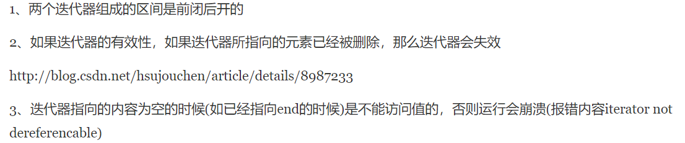
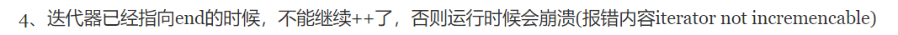
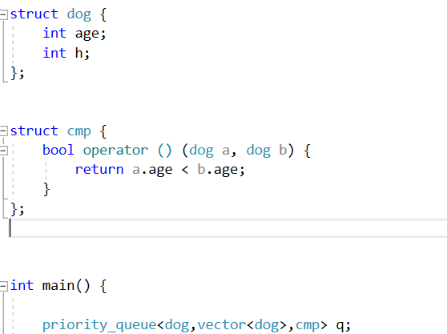
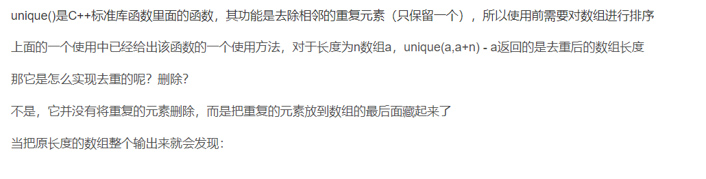
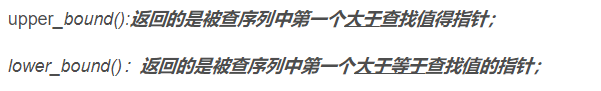
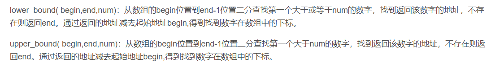
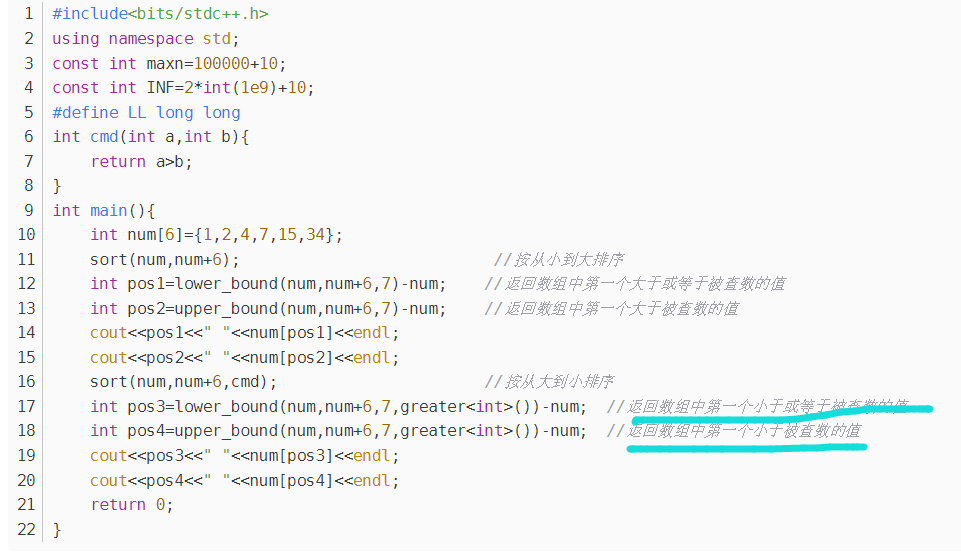

# STL

## 容器

```http
https://blog.csdn.net/piaoxuezhong/article/details/54348787


//这个绝了！！！
https://blog.csdn.net/qingyue_bao/article/details/6594892?utm_medium=distribute.pc_relevant.none-task-blog-BlogCommendFromBaidu-1.control&depth_1-utm_source=distribute.pc_relevant.none-task-blog-BlogCommendFromBaidu-1.control
```

#### 迭代器

[迭代器的注意事项](https://www.cnblogs.com/bewolf/p/4436093.html)





[erase的细节](https://blog.csdn.net/hsujouchen/article/details/8987233)

>1. 删除之后原迭代器失效
>2. erase函数返回下一个元素的迭代器，要用这个

```cpp
for ( std::list<*>::iterator it =ObjList.begin(); it != ObjList.end(); )
{
       if((*it)->regin == CheckRegin )
       {
              it= ObjList.erase(it);
       }
       else
      {
              ++it;
      }
}
```


#### 序列容器

- vector可以伸缩，必须往里面放元素才能用下标访问,直接`vector<int> a; a[3]=1`会报错

##### 优先队列

```http
https://www.cnblogs.com/huashanqingzhu/p/11040390.html
```


```http
https://blog.csdn.net/c20182030/article/details/70757660?utm_medium=distribute.pc_relevant_t0.none-task-blog-BlogCommendFromMachineLearnPai2-1.control&depth_1-utm_source=distribute.pc_relevant_t0.none-task-blog-BlogCommendFromMachineLearnPai2-1.control
```


***自定义的方法如下***

使用`struct`结构体来定义比较符



注意： `return a.age<b.age;`是大根堆，降序排列，因为默认就是降序排列 

a<b 说明 b更优先

在sort中 a<b 说明按 a < b < c排序:cowboy_hat_face:

运算符重载，就和原来进行比较 重载`<` 如果`return a.x<b.x;`说明与原来的<一个意思，否则相反意思。再根据这个看要`cmp`的函数应该怎么处理这个关系即可

像优先队列就是把优先的放在top，而sort是把<作为默认

## 算法

#### unique算法

[博客](https://blog.csdn.net/tomorrowtodie/article/details/51907471)



> unique返回的是去重后最后一个元素的后面的指针,相当于`a.end()`那个位置，而且去重后使用迭代器访问的话，end也是这个位置
>
> 如下是获取去重后的长度


#### upper_bound

前提是已经排好序，非减序列

就和二分差不多

#### 

[博客](https://blog.csdn.net/tjpuacm/article/details/26389441?utm_medium=distribute.pc_relevant.none-task-blog-BlogCommendFromMachineLearnPai2-1.control&depth_1-utm_source=distribute.pc_relevant.none-task-blog-BlogCommendFromMachineLearnPai2-1.control)



